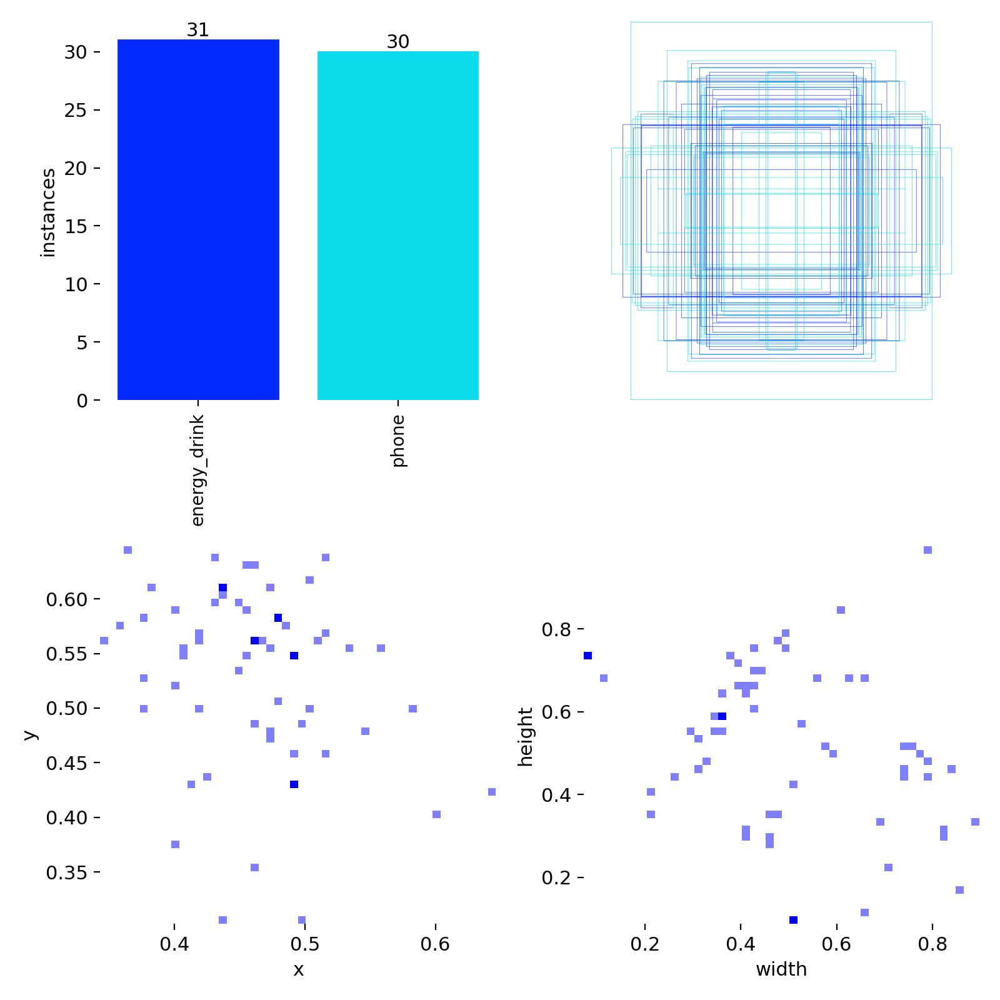
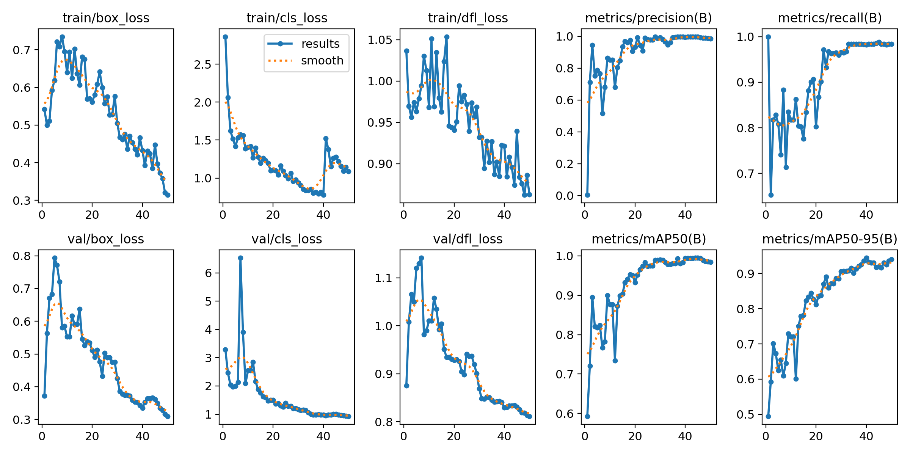
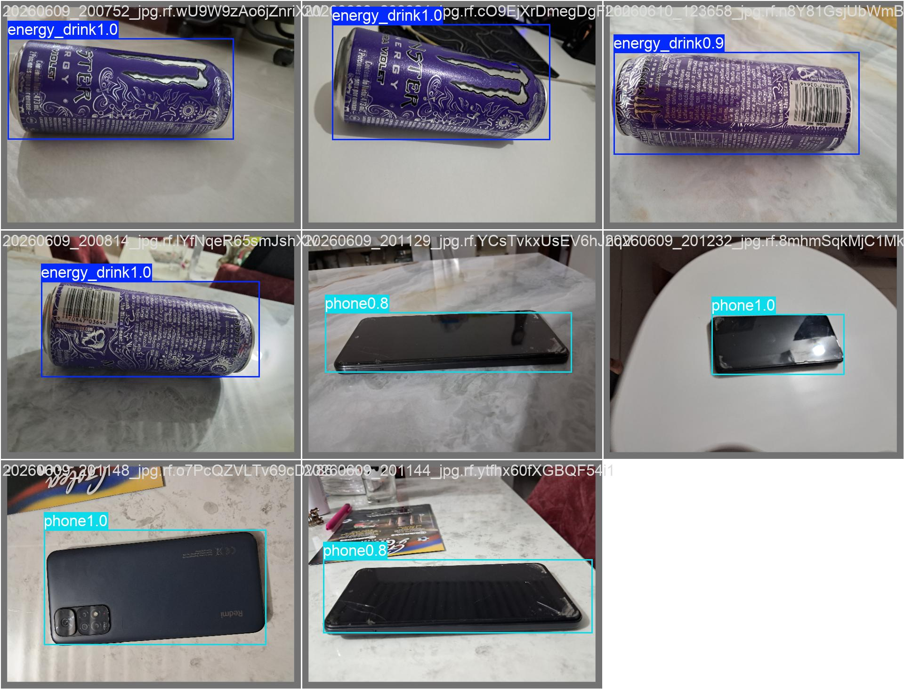
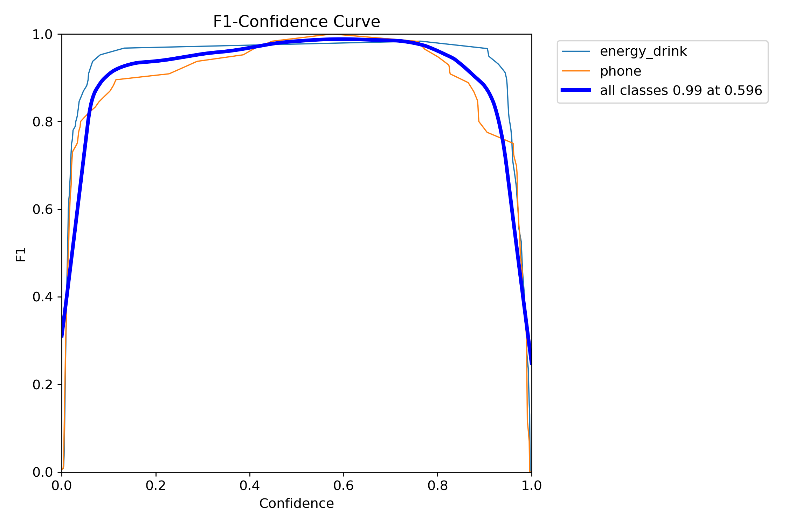
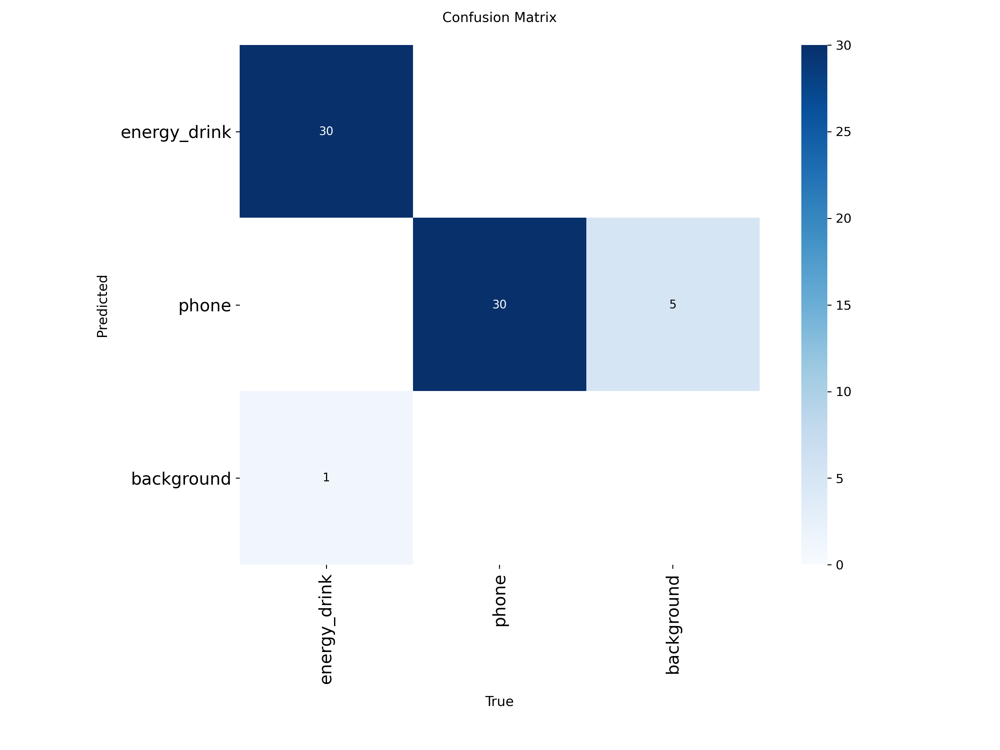
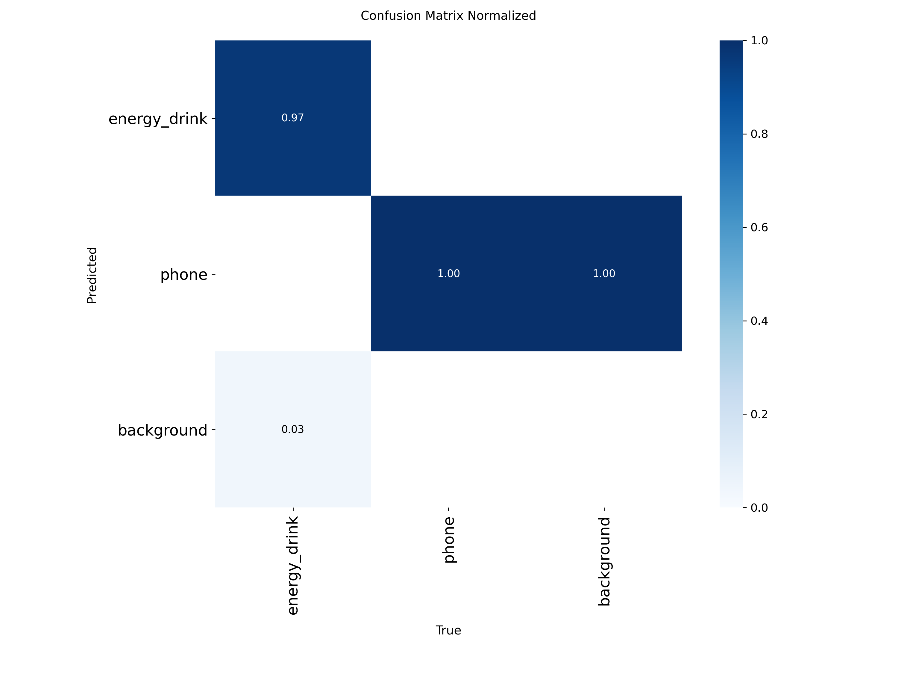

# 🎯 Detección de Objetos con YOLOv8

## Descripción del Proyecto

Sistema de detección de objetos en tiempo real desarrollado con YOLOv8 como proyecto final de la asignatura de Inteligencia Artificial. La aplicación identifica dos categorías de objetos usando una cámara web, aplicando las etapas completas de construcción del dataset, entrenamiento, evaluación y despliegue del modelo.

## Categorías Detectadas

| Clase | Descripción |
|-------|-------------|
| `energy_drink` | Lata de bebida energética (Monster) |
| `phone` | Teléfono celular |

## Estructura del Proyecto

```
proyecto/
├── train/
│   ├── images/
│   └── labels/
├── assets/
│   ├── results.png
│   ├── confusion_matrix.png
│   ├── confusion_matrix_normalized.png
│   ├── labels.jpg
│   ├── val_batch0_pred.jpg
│   └── BoxF1_curve.png
├── templates/
│   ├── index.html
│   └── result.html
├── data.yaml
├── index.py
├── prueba.py
├── app.py
├── requirements.txt
└── README.md
```

## Dataset

- **Herramienta de etiquetado:** Roboflow
- **Total de imágenes:** 60 (30 por clase)
- **Clases:** 2 (`energy_drink`, `phone`)
- **Formato de anotación:** YOLOv8
- **Construcción:** Dataset propio — imágenes capturadas y etiquetadas manualmente con bounding boxes en distintos ángulos, fondos e iluminaciones

### Distribución del dataset



El dataset quedó perfectamente balanceado con 31 instancias de `energy_drink` y 30 de `phone`, lo que garantiza que el modelo no tenga sesgo hacia ninguna clase.

## Entrenamiento del Modelo

### Parámetros utilizados

| Parámetro | Valor | Descripción |
|-----------|-------|-------------|
| `model` | yolov8n.pt | Modelo base YOLOv8 Nano preentrenado en COCO |
| `epochs` | 50 | Ciclos completos de entrenamiento sobre el dataset |
| `imgsz` | 640 | Tamaño de entrada de imagen (640×640 píxeles) |
| `batch` | 4 | Imágenes procesadas por iteración antes de actualizar pesos |
| `device` | cpu | Entrenamiento en CPU (AMD Ryzen 5 4600H) |
| `optimizer` | auto | Optimizador seleccionado automáticamente por Ultralytics |

### Explicación de parámetros clave

- **epochs=50:** El modelo recorre todo el dataset 50 veces. Cada época ajusta los pesos internos de la red para mejorar la detección. Con 60 imágenes, 50 épocas es un valor balanceado que permite aprender sin caer en overfitting.
- **imgsz=640:** Todas las imágenes se redimensionan a 640×640 píxeles antes de entrar a la red neuronal. Es el tamaño estándar de YOLOv8 que balancea velocidad y precisión.
- **batch=4:** El modelo procesa 4 imágenes simultáneamente y actualiza sus pesos después de cada grupo. Con CPU y 60 imágenes, batch=4 es adecuado para no saturar la memoria RAM.
- **yolov8n:** La versión Nano de YOLOv8, el modelo más liviano de la familia. Ideal para datasets pequeños y hardware sin GPU dedicada.

### Curvas de entrenamiento



Las gráficas muestran la evolución del modelo durante las 50 épocas:

- **box_loss:** Pérdida en la predicción de los bounding boxes. Disminuye consistentemente tanto en train como en val, lo que indica que el modelo aprende a ubicar los objetos correctamente.
- **cls_loss:** Pérdida de clasificación. La caída pronunciada al inicio y la estabilización posterior indican que el modelo aprendió rápidamente a distinguir entre `energy_drink` y `phone`.
- **dfl_loss:** Distribution Focal Loss, mide la precisión en los bordes del bounding box. También decrece de forma constante.
- **Precision y Recall:** Ambas métricas suben progresivamente hasta estabilizarse cerca de 1.0, confirmando que el modelo converge correctamente.
- **mAP50 y mAP50-95:** Suben de forma sostenida alcanzando valores superiores a 0.98 y 0.94 respectivamente al finalizar el entrenamiento.

### Predicciones en validación



Muestra cómo el modelo detecta los objetos sobre imágenes del conjunto de validación con sus respectivos scores de confianza.

## Métricas Obtenidas

El entrenamiento completó 50 épocas en aproximadamente 48 minutos sobre CPU.

### Resultados finales

| Clase | Images | Instances | Precision | Recall | mAP@50 | mAP@50-95 |
|-------|--------|-----------|-----------|--------|--------|-----------|
| **all** | 60 | 61 | 0.996 | 0.982 | 0.987 | 0.941 |
| energy_drink | 30 | 31 | 0.991 | 0.968 | 0.979 | 0.954 |
| phone | 30 | 30 | 1.000 | 0.996 | 0.995 | 0.928 |

## Explicación de las Métricas

### Precision (Precisión) — 0.996
Mide qué tan confiables son las detecciones del modelo. De todas las veces que el modelo afirmó haber detectado un objeto, el 99.6% de las veces tenía razón.

```
Precision = Verdaderos Positivos / (Verdaderos Positivos + Falsos Positivos)
```

Un valor cercano a 1.0 indica que el modelo prácticamente no genera falsas alarmas. La clase `phone` obtuvo una Precision perfecta de **1.0**, lo que significa que cada vez que el modelo detectó un celular, efectivamente había uno.

### Recall (Exhaustividad) — 0.982
Mide cuántos objetos reales presentes en las imágenes fue capaz de encontrar el modelo. De todos los objetos que existían, el modelo detectó el 98.2% de ellos.

```
Recall = Verdaderos Positivos / (Verdaderos Positivos + Falsos Negativos)
```

Un Recall de **0.982** indica que el modelo casi no se pierde objetos. La clase `phone` obtuvo **0.996**, detectando prácticamente todos los celulares presentes.

### mAP@50 — 0.987
Mean Average Precision con umbral de IoU del 50%. Una detección se considera correcta si el bounding box predicho se superpone al menos un **50%** con el bounding box real anotado manualmente.

Es la métrica más común para evaluar detectores de objetos. Valores de referencia: >0.5 aceptable, >0.75 bueno, >0.9 excelente. Este proyecto obtuvo **0.987**, un resultado sobresaliente para un dataset de 60 imágenes.

### mAP@50-95 — 0.941
Versión más estricta del mAP. Promedia el AP calculado con umbrales de IoU desde 0.50 hasta 0.95 en pasos de 0.05. Evalúa no solo si el modelo detecta el objeto, sino qué tan exactamente ubica el bounding box sobre él.

Es la métrica oficial del benchmark COCO. Un valor de **0.941** indica que el modelo localiza los objetos con muy alta precisión espacial.

### Curva F1-Confidence



La curva F1 muestra el balance entre Precision y Recall para distintos umbrales de confianza. El modelo alcanza un F1 máximo de **0.99 con un umbral de confianza de 0.596**, lo que indica que usar `conf=0.6` es el punto óptimo para maximizar tanto la precisión como el recall simultáneamente.

### Matriz de Confusión



La matriz de confusión muestra cómo clasifica el modelo cada objeto:

- **energy_drink:** 30 detecciones correctas, 1 falso negativo (clasificado como background)
- **phone:** 30 detecciones correctas, 5 detecciones de background clasificadas como phone

Esto explica por qué a veces el modelo detecta objetos del fondo como `phone` — es el único error que comete el modelo y corresponde a las falsas detecciones que se pueden ver en tiempo real.

### Matriz de Confusión Normalizada



Versión porcentual de la matriz de confusión. Muestra que:

- `energy_drink` se clasifica correctamente el **97%** de las veces
- `phone` se clasifica correctamente el **100%** de las veces

El 3% restante de `energy_drink` corresponde a objetos no detectados (falsos negativos).

### Análisis general

Los resultados son excelentes considerando el tamaño reducido del dataset. El uso de transfer learning desde `yolov8n.pt` preentrenado en COCO permitió obtener métricas de alto nivel con solo 60 imágenes. El único punto de mejora identificado es la tendencia del modelo a generar algunas falsas detecciones de `phone` sobre el fondo, lo cual se mitiga ajustando el umbral de confianza a `conf=0.6`.

## Implementación

### Opción A — Aplicación Web con Flask

Aplicación web que permite subir una imagen y visualizar las detecciones del modelo en el navegador.

```bash
pip install flask
python app.py
```

Abrir en el navegador: `http://127.0.0.1:5000`

### Opción B — Detección en Tiempo Real con OpenCV

Aplicación Python que accede a la cámara web y detecta los objetos en tiempo real.

```bash
python prueba.py
```

Presionar **Q** para salir.

## Instrucciones de Instalación

```bash
python -m venv venv
.\venv\Scripts\activate
pip install ultralytics flask
```

## Arquitectura Implementada

**YOLOv8 (You Only Look Once v8)** es una red neuronal convolucional de detección de objetos en una sola etapa desarrollada por Ultralytics. Procesa la imagen completa en un único paso forward, lo que la hace extremadamente rápida para detección en tiempo real.

### Componentes principales

- **Backbone (CSPDarknet):** Extrae características visuales de la imagen a múltiples escalas mediante capas convolucionales profundas.
- **Neck (PAN-FPN):** Combina características de diferentes escalas para detectar objetos grandes y pequeños simultáneamente.
- **Head:** Predice bounding boxes, scores de confianza y clases para cada región de la imagen en un solo paso.

### Transfer Learning

El modelo parte de `yolov8n.pt`, preentrenado en el dataset COCO con 80 clases. Durante el entrenamiento los pesos se ajustan mediante fine-tuning para reconocer `energy_drink` y `phone`, lo que permite obtener resultados de alta calidad con datasets pequeños.
